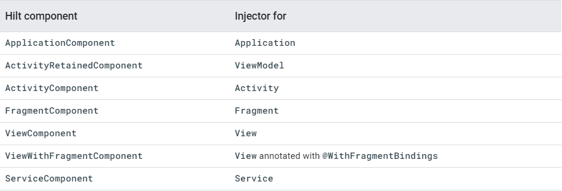
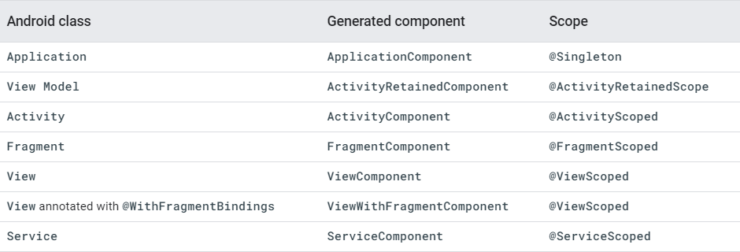

# 关于配置

1. 配置相关的插件

```groovy
buildscript {
    dependencies {
        classpath "com.android.tools.build:gradle:7.0.4"
        classpath "org.jetbrains.kotlin:kotlin-gradle-plugin:1.6.10"
        classpath 'com.google.dagger:hilt-android-gradle-plugin:2.43'
    }
}
```

这个注意在gradle-7.2以上的版本和之前是不一样的.

2. 在app的build.gradle中添加如下配置:

```groovy
    //引入相应的插件
id 'kotlin-kapt'
id 'com.google.dagger.hilt.android'

//引入相应的类库
implementation 'com.google.dagger:hilt-android:2.43'
kapt 'com.google.dagger:hilt-compiler:2.43'
```

# 关于使用

## 1.1 简单使用

1. 在Application中添加注释 **@HiltAndroidApp**
2. 在使用依赖的Activity中添加注释 **@AndroidEntryPoint**
3. 在需要依赖注入的类的构造方法中添加注释 **@Inject**
4. 在使用注入依赖的对象上添加注释 **@Inject**

# 常见的问题

1. 有参数/接口的注入依赖?
2. 如果有第三方,或者基本类型的注入依赖要怎么处理?
3. 关于上下文的问题

## 1. 有参数/接口的依赖注入

### 1.1 关于有参数的依赖注入应该分为两种情况:

1. 自己创建的类(自己可以找到构造方法的)
2. 第三方或者基本数据类型的(自己找不到构造方法的)

关于第一种还是比较好处理的,就是在构造方法上面添加 **@Inject** 这个注解就行了,比较简单就不在这里说了.对于第二种相对于第一种来说就比较复杂了.

其实对于第二种情况我们先梳理一下为什么说比较复杂,因为我不知道怎么创建这个实例对吧?如果让Hilt知道怎么创建实例,是不是就解决这个问题了.所以问题就转换成怎么让Hilt找到这个实例.这里就用到了Model这个注解了.

```kotlin
@Module
@InstallIn(ActivityComponent::class)
class NameModel {

    @Provides
    fun driverAge(): String {
        return "18"
    }
}

class Driver @Inject constructor(val age: String)
```

这里面通过Module和Provides这两个注解就能匹配到相应的创建了.上面的实例driverAge实例其实就是创建司机的年龄,也就是在创建Driver的时候需要的年龄字段.

这里细心的网友可能又有问题了,如果我创建Driver的时候即需要年龄又需要名称怎么办?怎么区分这两个String类型哪个是年龄,哪个是姓名的呢?

针对以上问题就引出了通过注解去区分相应注入到哪里.

```kotlin
class Driver @Inject constructor(@Name val name: String, @Age val age: String)

@Module
@InstallIn(ActivityComponent::class)
class NameModel {

    @Name
    @Provides
    fun driverName(): String {
        return "张三"
    }

    @Age
    @Provides
    fun driverAge(): String {
        return "18"
    }
}


@Qualifier
@Retention(AnnotationRetention.RUNTIME)
internal annotation class Age

@Qualifier
@Retention(AnnotationRetention.RUNTIME)
internal annotation class Name
```

通过@Qualifier创建注解来区分注入到哪里,在相应的构造方法中添加注解就可以了.

### 1.2 关于接口的注入依赖

接口的注入依赖和上面的差不多,都是需要@Module和@InstallIn的,其实所有的创建类型都是需要这两个注解的.

```kotlin
interface Engine {
    fun start()
    fun shutdown()
}

class GasEngine @Inject constructor() : Engine {
    override fun start() {
        println("Gas engine start.")
    }

    override fun shutdown() {
        println("Gas engine shutdown.")
    }
}

class ElectricEngine @Inject constructor() : Engine {
    override fun start() {
        println("Electric engine start.")
    }

    override fun shutdown() {
        println("Electric engine shutdown.")
    }
}


@Module
@InstallIn(ActivityComponent::class)
abstract class EngineModule {

    @Binds
    abstract fun bindEngine(gasEngine: GasEngine): Engine

}
```

接口的依赖注入和之前的都差不多,就是需要创建一个abstract的类,这个就是主要的区别.其实也是上面的问题,你要是不创建这个抽象类的话,Hilt不知道去哪里能找到相应的构造方法.那么和上面就有相同的处理方案了, 就是通过@Module和@InstallIn来进行相应的处理

那么上面的问题就有也有等效的处理方案了(因为接口有两个相同的实例.创建不同的实例要怎么处理?),这个就和上面的处理方式一样了.就是添加注解进行区分.

```kotlin
interface Engine {
    fun start()
    fun shutdown()
}

class GasEngine @Inject constructor() : Engine {
    override fun start() {
        println("Gas engine start.")
    }

    override fun shutdown() {
        println("Gas engine shutdown.")
    }
}

class ElectricEngine @Inject constructor() : Engine {
    override fun start() {
        println("Electric engine start.")
    }

    override fun shutdown() {
        println("Electric engine shutdown.")
    }
}


@Module
@InstallIn(ActivityComponent::class)
abstract class EngineModule {

    @Binds
    @BindGasEngine
    abstract fun bindGasEngine(gasEngine: GasEngine): Engine

    @Binds
    @BindElectricEngine
    abstract fun bindElectricEngine(gasEngine: ElectricEngine): Engine
}

@Qualifier
@Retention(AnnotationRetention.RUNTIME)
internal annotation class BindGasEngine

@Qualifier
@Retention(AnnotationRetention.RUNTIME)
internal annotation class BindElectricEngine
```







### 1.3 关于上下文的问题

在Android开发中很难不用到上下文,提到上下文就会有相应的问题?我要怎么处理依赖注入中的上下文问题?

Hilt预制了两个关于上下文的注释

1. @ApplicationContext 全局的上下文
2. @ActivityContext Activity的上下文

这里其实还有一个问题,如果你在构造方法中使用的是Activity或者Application的构造函数,可以不写注解(但是仅限这两个,子类和其他的类都不好使),之前在郭神的博客中看见一个提供全局Application的依赖注入的Model,这样在使用的时候就可以不用创建相应的注解了,这个因人而异吧.

## 关于ViewModel的使用(MVVM)

关于ViewModel使用Hilt有两种方案:

1. 使用原始的注解方式
2. 使用@HiltViewModel注解

### 1. 使用原始的注解方式

```kotlin
@ActivityRetainedScoped
class HiltViewModel @Inject constructor(private val repository: HiltRepository) : ViewModel() {

    fun getUserName(): String {
        return repository.getUserName()
    }
}

@Inject
lateinit var hiltViewModel: HiltViewModel
```

原始方式使用的是@ActivityRetainedScoped注解,但是这种方式有一个问题,就是ViewModel也需要依赖注入.

### 2. 使用@HiltViewModel注解

```kotlin
@HiltViewModel
class HiltViewModel @Inject constructor(private val repository: HiltRepository) : ViewModel() {
    fun getUserName(): String {
        return repository.getUserName()
    }
}

val hiltViewModel by lazy {
    ViewModelProvider(this)[HiltViewModel::class.java]
}
```

这种方式保留了原始的ViewModel的创建方式.